# ASIC Implementation of a RISC-V Processor in 14-nm CMOS Technology

**Author:** Oscar Benjamin Barajas
**Institution:** San Francisco State University — M.S. Electrical and Computer Engineering
**Year:** Spring 2026
**Advisor:** Dr. Hamid Mahmoodi

---

## Overview

This repository documents the complete ASIC implementation of a 5-stage pipelined RISC-V CPU processor using the Synopsys EDA tool suite and a 14-nm CMOS technology library (SAED 14-nm EDK). The project follows the full RTL-to-GDSII design flow used in industry.

> ⚠️ **Note:** Due to licensing restrictions, SAED 14-nm library files and proprietary Synopsys tool outputs (GDSII, `.db`, `.lib`) are **not included** in this repository. Scripts and RTL are provided for reference.

---

## Architecture

The processor implements a custom RISC-V-style ISA with:

- **32-bit** fixed-width instructions, 32 general-purpose registers
- **Custom 7-bit opcode encoding** (simplified from standard RISC-V)
- **5-stage pipeline:** Instruction Fetch → Decode → Execute → Memory → Write Back
- **Hazard Detection Unit** with pipeline stalling
- **Forwarding Unit** for ALU-to-ALU and MEM-to-ALU forwarding
- **SRAM-style Data Memory** (4096 × 32-bit flip-flop array)

### Instruction Set Summary

| Opcode   | Format | Instructions                                |
|----------|--------|---------------------------------------------|
| 0000001  | R      | ADD, SUB, SLT, AND, OR, XOR, SLL, SRL, SRA |
| 0000010  | I      | ADDI, SLTI, SLTIU                           |
| 0000011  | I      | ANDI, ORI, XORI                             |
| 0000100  | I      | SLLI, SRLI, SRAI                            |
| 0000101  | B      | BEQ                                         |
| 0000110  | J      | JUMP                                        |
| 0000111  | S      | STORE (32-bit word)                         |
| 0001000  | I      | LOAD (32-bit word)                          |

### RISC-V Base Instruction Formats

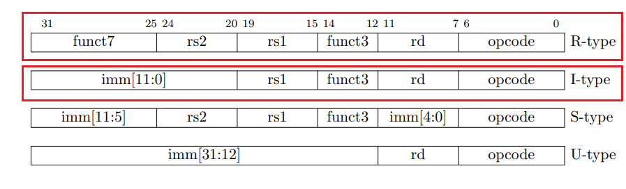

*Figure 2: R-type, I-type, S-type, and U-type instruction encoding formats used in the design.*

---

## ASIC Design Flow

```
RTL Design (Verilog)
        │
        ▼
Functional Verification (VCS + Verdi)
        │
        ▼
Logic Synthesis (Design Compiler → Gate-Level Netlist)
        │
        ▼
Pre-Layout STA (PrimeTime)
        │
        ▼
Physical Implementation (IC Compiler II)
   ├── Floorplanning
   ├── Power/Ground Network
   ├── Placement
   ├── Clock Tree Synthesis
   └── Routing
        │
        ▼
Post-Layout STA (PrimeTime on extracted netlist)
        │
        ▼
GDSII
```

---

## Pipeline Architecture

### Five-Stage Pipeline Timing

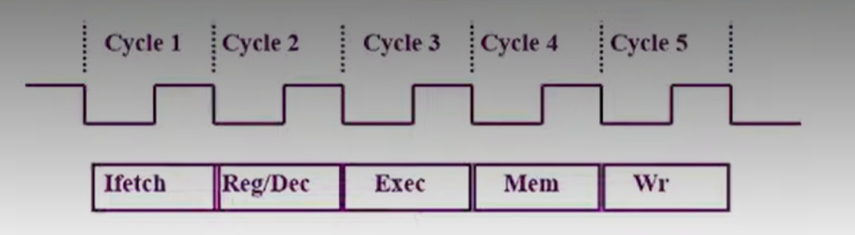

*Figure 3: Clock cycle timing diagram showing the 5-stage pipeline — Fetch, Decode, Execute, Memory, Write Back.*

### Single-Cycle Datapath

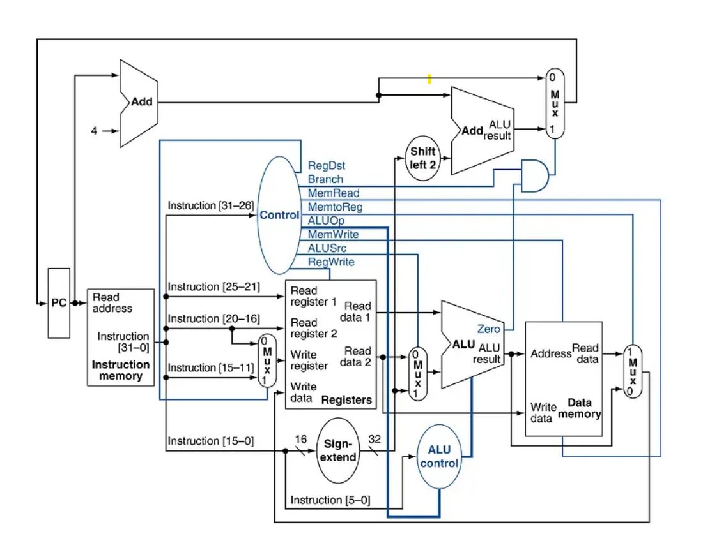

*Figure 4: RISC-V single-cycle datapath showing the PC, instruction memory, register file, ALU, data memory, and control unit.*

### TOP_CPU Module

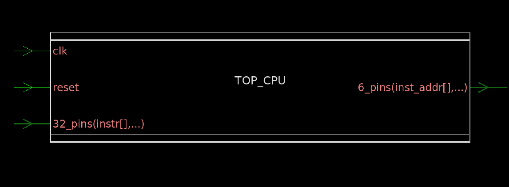

*Figure 6: Block-level view of the TOP_CPU module. Inputs: CLK, Reset, 32-bit instruction. Output: 6-bit instruction address.*

---

## Functional Verification

### VCS Simulation Report

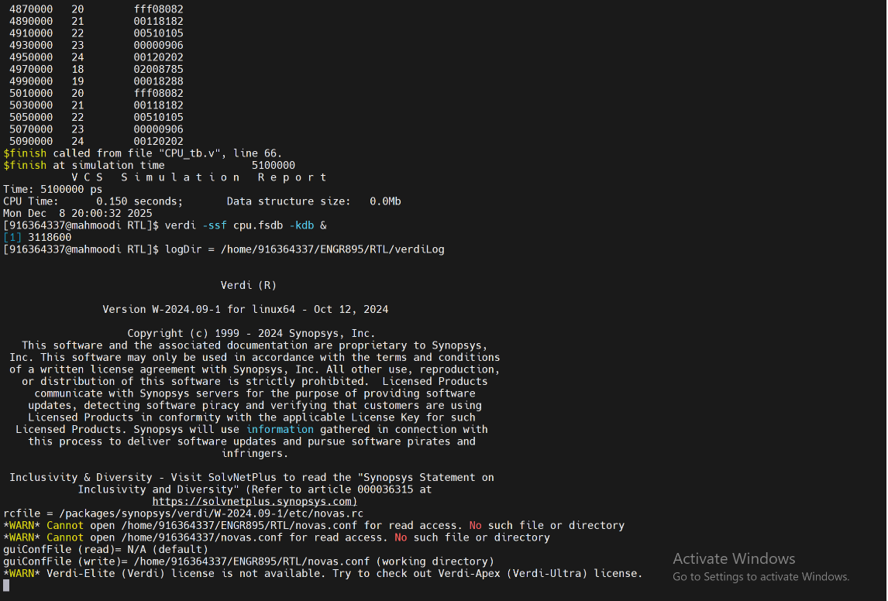

*Figure 7: VCS simulation completed at 5,100,000 ps (5.1 μs) with no runtime errors, confirming RTL correctness.*

### Verdi Waveform

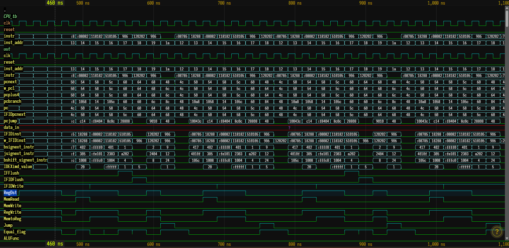

*Figure 12: Verdi waveform showing pipeline signal activity during program execution. All major datapath and control signals exhibit correct cycle-by-cycle behavior.*

---

## Synthesis — Gate-Level Schematics

### Hierarchical Design View

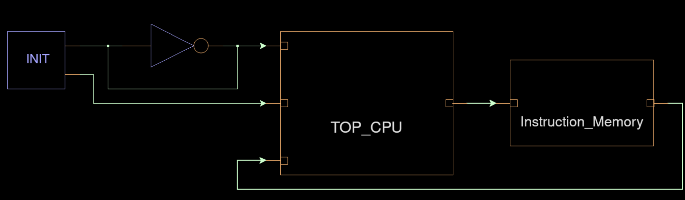

*Figure 13: Hierarchical view of the TOP_CPU design showing the top-level module connected to instruction memory.*

### Full Gate-Level Schematic

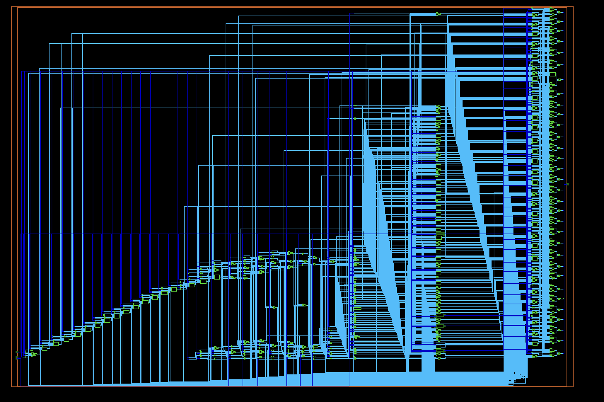

*Figure 15: Full schematic of TOP_CPU after synthesis, showing the complete gate-level netlist mapped to SAED 14-nm standard cells.*

---

## Physical Implementation (ICC2)

### Post-Placement

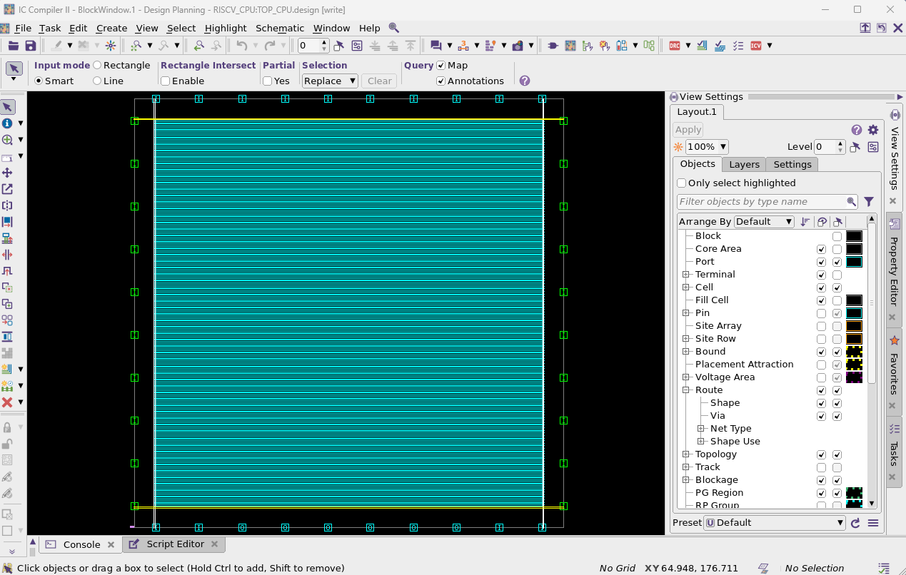

*Figure 28: Post-placement view in ICC2. The core area is filled with densely packed standard-cell rows meeting area constraints.*

### Fully Routed Layout

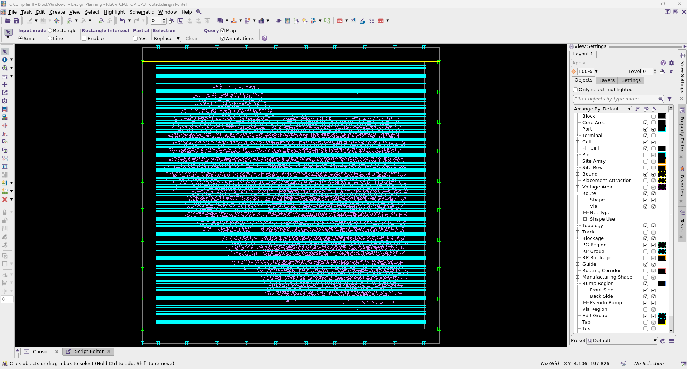

*Figure 31: Fully routed TOP_CPU layout after route_auto and optimize_routes. All cells are placed and all signals are routed.*

### Routed Layout — Magnified

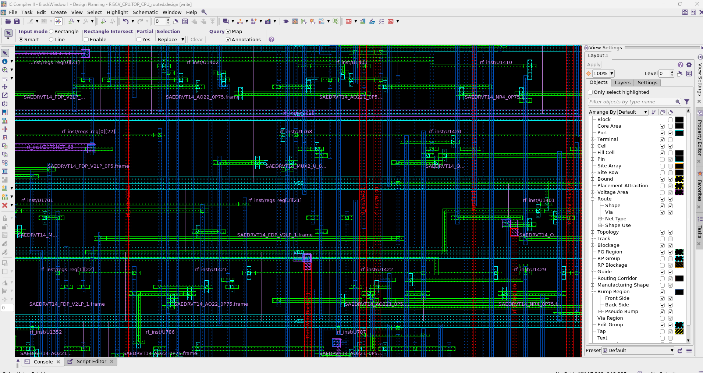

*Figure 32: Magnified view of the routed design, showing individual SAED 14-nm standard cells and routing tracks.*

---

## Key Results

| Stage                   | Metric              | Result              |
|-------------------------|---------------------|---------------------|
| RTL Simulation          | Simulation time     | 5.1 μs — No errors  |
| Synthesis               | Clock target        | 200 MHz (5 ns)      |
| Pre-Layout Setup Slack  | PrimeTime           | +3.88 ns ✅          |
| Pre-Layout Hold Slack   | PrimeTime           | +0.05 ns ✅          |
| Post-Layout Setup Slack | ICC2 post-CTS       | +2.83 ns ✅          |
| Post-Layout Hold Slack  | ICC2 post-CTS       | +0.02 ns ✅          |
| Total Dynamic Power     | PrimeTime           | 1.21 mW             |
| Cell Leakage Power      | PrimeTime           | 9.01 mW             |
| Total Cell Count        | Design Compiler     | 20,943 cells         |
| Total Area              | Design Compiler     | 28,226 units²        |

---

## Repository Structure

```
riscv-asic-14nm/
├── rtl/                        # Verilog RTL source files
│   ├── TOP_CPU.v
│   ├── ALU.v
│   ├── control_unit.v
│   ├── register_file.v
│   ├── hazard_detection.v
│   ├── forwarding_unit.v
│   ├── data_memory.v
│   └── pipeline_regs/
│       ├── IFID_reg.v
│       ├── IDEX_reg.v
│       ├── EXMEM_reg.v
│       └── MEMWB_reg.v
├── verification/
│   ├── tb/                     # Testbenches
│   │   └── TOP_CPU_tb.v
│   └── scripts/                # VCS compile & simulation scripts
│       ├── compile.sh
│       └── simulate.sh
├── synthesis/
│   ├── scripts/                # Design Compiler TCL scripts
│   │   ├── dc_setup.tcl
│   │   └── dc_compile.tcl
│   ├── reports/                # Area, power, timing reports
│   └── netlist/                # Gate-level netlist (post-synthesis)
│       └── TOP_CPU_NETLIST.v
├── primetime/
│   ├── pre_layout/             # Pre-layout STA scripts & reports
│   └── post_layout/            # Post-layout STA scripts & reports
├── pnr/
│   ├── scripts/                # ICC2 TCL scripts
│   ├── reports/                # ICC2 area, power, QoR, utilization
│   └── blocks/                 # Saved ICC2 design blocks
├── docs/
│   ├── thesis_summary.md       # Project summary
│   └── figures/                # Layout screenshots, schematics
├── .gitignore
└── README.md
```

---

## Tools Used

| Tool                        | Purpose                              |
|-----------------------------|--------------------------------------|
| Synopsys VCS                | RTL functional simulation            |
| Synopsys Verdi              | Waveform analysis & debug            |
| Synopsys Design Compiler    | Logic synthesis                      |
| Synopsys PrimeTime          | Static timing analysis               |
| Synopsys IC Compiler II     | Place & route, CTS                   |
| SAED 14-nm EDK              | Standard cell library (HVT/LVT/RVT)  |

---

## References

1. A. Waterman et al., *RISC-V Instruction Set Manual*, RISC-V Foundation, 2019
2. D. A. Patterson & J. L. Hennessy, *Computer Organization and Design RISC-V Edition*, 2020
3. T. K. Prakasam, *ASIC Implementation of a RISC-V Processor*, SFSU, 2018
4. L. Singh, *Tutorial on ASIC Design Flow Using Synopsys Tools with 14-nm*, SFSU, 2020
5. N. H. E. Weste & D. Harris, *CMOS VLSI Design*, 4th ed., Addison-Wesley, 2011

---

## License

This project is released for academic and educational reference. The RTL and scripts are original work by Oscar Benjamin Barajas © 2026. SAED 14-nm library files are proprietary to Synopsys and are not redistributed.
